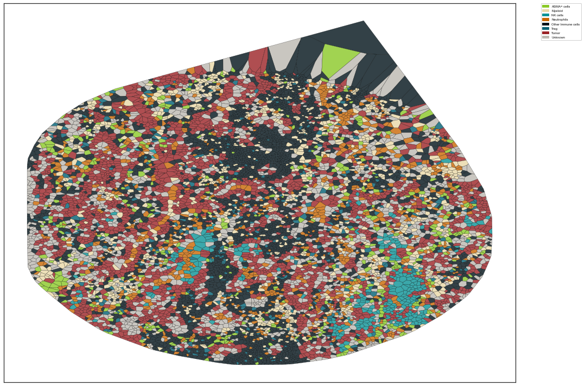

```python
"""
Created on Mon May 16 19:00:32 2022
@author: Ajit Johnson Nirmal
SCIMAP tutorial May 2022
"""
```


```python
# load packages
import scimap as sm
import scanpy as sc
import pandas as pd
```

## Tutorial material

You can download the material for this tutorial from the following [link:](https://dataverse.harvard.edu/dataset.xhtml?persistentId=doi:10.7910/DVN/98WEMD)  
The jupyter notebook is available [here:](https://github.com/ajitjohnson/scimap_tutorials/tree/main/may_2022_tutorial)


```python
common_path = "/Users/aj/Dropbox (Partners HealthCare)/conferences/scimap_tutorial/may_2022_tutorial/"
#common_path = "C:/Users/ajn16/Dropbox (Partners HealthCare)/conferences/scimap_tutorial/may_2022_tutorial/"
```


```python
# load data
adata = sm.pp.mcmicro_to_scimap (image_path= str(common_path) + 'exemplar_001/quantification/unmicst-exemplar-001_cell.csv')
```

    Loading unmicst-exemplar-001_cell.csv


```python
adata
```


    AnnData object with n_obs × n_vars = 11170 × 9
        obs: 'X_centroid', 'Y_centroid', 'Area', 'MajorAxisLength', 'MinorAxisLength', 'Eccentricity', 'Solidity', 'Extent', 'Orientation', 'imageid'
        uns: 'all_markers'


```python
# Markers in dataset
adata.var.index
```


    Index(['ELANE', 'CD57', 'CD45', 'CD11B', 'SMA', 'CD16', 'ECAD', 'FOXP3',
           'NCAM'],
          dtype='object')


### manually gate the data


```python
# manually gate the data
image_path = str(common_path) + 'exemplar_001/registration/exemplar-001.ome.tif'
```


```python
marker_of_interest = 'ECAD'
```


```python
sm.pl.gate_finder (image_path, adata, marker_of_interest, 
                   from_gate = 5, to_gate = 9, increment = 0.1, 
                   point_size=10)
```


```python

```

### rescale the data based on the manual gates


```python
manual_gate = pd.read_csv(str(common_path) + 'manual_gates.csv')
```


```python
manual_gate
```


<div>
<style scoped>
    .dataframe tbody tr th:only-of-type {
        vertical-align: middle;
    }

    .dataframe tbody tr th {
        vertical-align: top;
    }

    .dataframe thead th {
        text-align: right;
    }
</style>
<table border="1" class="dataframe">
  <thead>
    <tr style="text-align: right;">
      <th></th>
      <th>markers</th>
      <th>gate</th>
    </tr>
  </thead>
  <tbody>
    <tr>
      <th>0</th>
      <td>ELANE</td>
      <td>7.9</td>
    </tr>
    <tr>
      <th>1</th>
      <td>CD57</td>
      <td>8.1</td>
    </tr>
    <tr>
      <th>2</th>
      <td>CD45</td>
      <td>6.3</td>
    </tr>
    <tr>
      <th>3</th>
      <td>CD11B</td>
      <td>7.2</td>
    </tr>
    <tr>
      <th>4</th>
      <td>SMA</td>
      <td>7.6</td>
    </tr>
    <tr>
      <th>5</th>
      <td>CD16</td>
      <td>6.8</td>
    </tr>
    <tr>
      <th>6</th>
      <td>ECAD</td>
      <td>7.4</td>
    </tr>
    <tr>
      <th>7</th>
      <td>FOXP3</td>
      <td>7.0</td>
    </tr>
    <tr>
      <th>8</th>
      <td>NCAM</td>
      <td>7.2</td>
    </tr>
  </tbody>
</table>
</div>


```python
# rescale the data
adata = sm.pp.rescale (adata, gate=manual_gate)
```

    Scaling Image ['unmicst-exemplar-001_cell']
    Scaling ELANE
    Scaling CD57
    Scaling CD45
    Scaling CD11B
    Scaling SMA
    Scaling CD16
    Scaling ECAD
    Scaling FOXP3
    Scaling NCAM


```python

```

### Phenotyping cells


```python
# load the phenotyping workflow
phenotype = pd.read_csv(str(common_path) + 'phenotype_workflow.csv')
```


```python
phenotype.style.format(na_rep='')
```


<style type="text/css">
</style>
<table id="T_2457a">
  <thead>
    <tr>
      <th class="blank level0" >&nbsp;</th>
      <th id="T_2457a_level0_col0" class="col_heading level0 col0" >Unnamed: 0</th>
      <th id="T_2457a_level0_col1" class="col_heading level0 col1" >Unnamed: 1</th>
      <th id="T_2457a_level0_col2" class="col_heading level0 col2" >CD57</th>
      <th id="T_2457a_level0_col3" class="col_heading level0 col3" >CD45</th>
      <th id="T_2457a_level0_col4" class="col_heading level0 col4" >CD11B</th>
      <th id="T_2457a_level0_col5" class="col_heading level0 col5" >SMA</th>
      <th id="T_2457a_level0_col6" class="col_heading level0 col6" >CD16</th>
      <th id="T_2457a_level0_col7" class="col_heading level0 col7" >ECAD</th>
      <th id="T_2457a_level0_col8" class="col_heading level0 col8" >FOXP3</th>
    </tr>
  </thead>
  <tbody>
    <tr>
      <th id="T_2457a_level0_row0" class="row_heading level0 row0" >0</th>
      <td id="T_2457a_row0_col0" class="data row0 col0" >all</td>
      <td id="T_2457a_row0_col1" class="data row0 col1" >Other Immune cells</td>
      <td id="T_2457a_row0_col2" class="data row0 col2" >anypos</td>
      <td id="T_2457a_row0_col3" class="data row0 col3" >anypos</td>
      <td id="T_2457a_row0_col4" class="data row0 col4" >anypos</td>
      <td id="T_2457a_row0_col5" class="data row0 col5" ></td>
      <td id="T_2457a_row0_col6" class="data row0 col6" >anypos</td>
      <td id="T_2457a_row0_col7" class="data row0 col7" ></td>
      <td id="T_2457a_row0_col8" class="data row0 col8" >anypos</td>
    </tr>
    <tr>
      <th id="T_2457a_level0_row1" class="row_heading level0 row1" >1</th>
      <td id="T_2457a_row1_col0" class="data row1 col0" >all</td>
      <td id="T_2457a_row1_col1" class="data row1 col1" >ASMA+ cells</td>
      <td id="T_2457a_row1_col2" class="data row1 col2" ></td>
      <td id="T_2457a_row1_col3" class="data row1 col3" ></td>
      <td id="T_2457a_row1_col4" class="data row1 col4" ></td>
      <td id="T_2457a_row1_col5" class="data row1 col5" >pos</td>
      <td id="T_2457a_row1_col6" class="data row1 col6" ></td>
      <td id="T_2457a_row1_col7" class="data row1 col7" ></td>
      <td id="T_2457a_row1_col8" class="data row1 col8" ></td>
    </tr>
    <tr>
      <th id="T_2457a_level0_row2" class="row_heading level0 row2" >2</th>
      <td id="T_2457a_row2_col0" class="data row2 col0" >all</td>
      <td id="T_2457a_row2_col1" class="data row2 col1" >Tumor</td>
      <td id="T_2457a_row2_col2" class="data row2 col2" ></td>
      <td id="T_2457a_row2_col3" class="data row2 col3" ></td>
      <td id="T_2457a_row2_col4" class="data row2 col4" ></td>
      <td id="T_2457a_row2_col5" class="data row2 col5" ></td>
      <td id="T_2457a_row2_col6" class="data row2 col6" ></td>
      <td id="T_2457a_row2_col7" class="data row2 col7" >pos</td>
      <td id="T_2457a_row2_col8" class="data row2 col8" ></td>
    </tr>
    <tr>
      <th id="T_2457a_level0_row3" class="row_heading level0 row3" >3</th>
      <td id="T_2457a_row3_col0" class="data row3 col0" >Other Immune cells</td>
      <td id="T_2457a_row3_col1" class="data row3 col1" >Myeloid</td>
      <td id="T_2457a_row3_col2" class="data row3 col2" ></td>
      <td id="T_2457a_row3_col3" class="data row3 col3" ></td>
      <td id="T_2457a_row3_col4" class="data row3 col4" >pos</td>
      <td id="T_2457a_row3_col5" class="data row3 col5" ></td>
      <td id="T_2457a_row3_col6" class="data row3 col6" ></td>
      <td id="T_2457a_row3_col7" class="data row3 col7" ></td>
      <td id="T_2457a_row3_col8" class="data row3 col8" ></td>
    </tr>
    <tr>
      <th id="T_2457a_level0_row4" class="row_heading level0 row4" >4</th>
      <td id="T_2457a_row4_col0" class="data row4 col0" >Other Immune cells</td>
      <td id="T_2457a_row4_col1" class="data row4 col1" >NK cells</td>
      <td id="T_2457a_row4_col2" class="data row4 col2" >pos</td>
      <td id="T_2457a_row4_col3" class="data row4 col3" ></td>
      <td id="T_2457a_row4_col4" class="data row4 col4" ></td>
      <td id="T_2457a_row4_col5" class="data row4 col5" ></td>
      <td id="T_2457a_row4_col6" class="data row4 col6" ></td>
      <td id="T_2457a_row4_col7" class="data row4 col7" ></td>
      <td id="T_2457a_row4_col8" class="data row4 col8" ></td>
    </tr>
    <tr>
      <th id="T_2457a_level0_row5" class="row_heading level0 row5" >5</th>
      <td id="T_2457a_row5_col0" class="data row5 col0" >Other Immune cells</td>
      <td id="T_2457a_row5_col1" class="data row5 col1" >Neutrophils</td>
      <td id="T_2457a_row5_col2" class="data row5 col2" ></td>
      <td id="T_2457a_row5_col3" class="data row5 col3" ></td>
      <td id="T_2457a_row5_col4" class="data row5 col4" ></td>
      <td id="T_2457a_row5_col5" class="data row5 col5" ></td>
      <td id="T_2457a_row5_col6" class="data row5 col6" >pos</td>
      <td id="T_2457a_row5_col7" class="data row5 col7" ></td>
      <td id="T_2457a_row5_col8" class="data row5 col8" ></td>
    </tr>
    <tr>
      <th id="T_2457a_level0_row6" class="row_heading level0 row6" >6</th>
      <td id="T_2457a_row6_col0" class="data row6 col0" >Other Immune cells</td>
      <td id="T_2457a_row6_col1" class="data row6 col1" >Treg</td>
      <td id="T_2457a_row6_col2" class="data row6 col2" ></td>
      <td id="T_2457a_row6_col3" class="data row6 col3" ></td>
      <td id="T_2457a_row6_col4" class="data row6 col4" ></td>
      <td id="T_2457a_row6_col5" class="data row6 col5" ></td>
      <td id="T_2457a_row6_col6" class="data row6 col6" ></td>
      <td id="T_2457a_row6_col7" class="data row6 col7" ></td>
      <td id="T_2457a_row6_col8" class="data row6 col8" >pos</td>
    </tr>
  </tbody>
</table>


```python
# Run the phenotyping algorithm
adata = sm.tl.phenotype_cells (adata, phenotype=phenotype, label="phenotype") 
```

    Phenotyping Other Immune cells
    Phenotyping ASMA+ cells
    Phenotyping Tumor
    -- Subsetting Other Immune cells
    Phenotyping Myeloid
    Phenotyping NK cells
    Phenotyping Neutrophils
    Phenotyping Treg
    Consolidating the phenotypes across all groups


```python
# Check the number of phenotyped cells
adata.obs['phenotype'].value_counts()
```


    Other Immune cells    3707
    Tumor                 2499
    Unknown               1782
    Myeloid               1140
    Neutrophils            895
    ASMA+ cells            457
    Treg                   364
    NK cells               326
    Name: phenotype, dtype: int64


```python
# Visualize cell types
sm.pl.image_viewer (image_path, adata, overlay = 'phenotype', point_color='white', point_size=10)
```


```python
# add seg mask
seg_mask_path = str(common_path) + 'exemplar_001/qc/s3seg/unmicst-exemplar-001/cellOutlines.ome.tif'
sm.pl.image_viewer (image_path, adata, 
                    seg_mask = seg_mask_path,
                    overlay = 'phenotype', 
                    point_color='white', 
                    point_size=10)
```


```python
# Visualize heatmap of cell types
sc.pl.matrixplot(adata, var_names= adata.var.index, groupby='phenotype', dendrogram=True, use_raw=False, cmap="vlag", standard_scale='var')
```

    ... storing 'imageid' as categorical
    ... storing 'phenotype' as categorical


    WARNING: dendrogram data not found (using key=dendrogram_phenotype). Running `sc.tl.dendrogram` with default parameters. For fine tuning it is recommended to run `sc.tl.dendrogram` independently.


    

    


### Voronoi Plots


```python
sm.pl.voronoi(adata, color_by='phenotype', 
                 voronoi_edge_color = 'black',
                 voronoi_line_width = 0.3, 
                 voronoi_alpha = 0.8, 
                 size_max=5000,
                 overlay_points=None, 
                 plot_legend=True, 
                 legend_size=6)
```


    

    


```python
# Map user defined colors
colors = {'ASMA+ cells': '#8AC926', 
          'Myeloid': "#E9D8A6", 
          'NK cells':  "#0A9396",
          'Neutrophils': "#CA6702", 
          'Other Immune cells':'#001219',
          'Treg': "#005F73", 
          'Tumor':  "#9B2226",
          'Unknown': '#BCB8B1'
    }
```


```python
import matplotlib.pyplot as plt
plt.rcParams['figure.figsize'] = [15, 10]
sm.pl.voronoi(adata, color_by='phenotype', 
                  colors = colors,
                 voronoi_edge_color = 'black',
                 voronoi_line_width = 0.3, 
                 voronoi_alpha = 0.8, 
                 #size_max=5000,
                 overlay_points=None, 
                 plot_legend=True, 
                 legend_size=6)
```


    

    


```python

```

### Adding ROI to images


```python
adata = sm.pl.addROI_image(image_path, adata, 
                             subset=None, 
                             imageid='imageid', 
                             overlay=None, overlay_category=None,
                             markers=None, 
                             channel_names='default', 
                             x_coordinate='X_centroid', y_coordinate='Y_centroid', 
                             seg_mask=None, 
                             overwrite=True, 
                             label='ROI')
```

    
            Opening Napari;
            Add shape layers (on left) to draw ROI's. 
            Rename the shape layer to give a name to your ROI
            Multiple shape layers are supported
            ROI's should not overlap
            Close Napari to save ROI's.
            
    Identifying cells within selected ROI's


    /opt/anaconda3/envs/scimap/lib/python3.9/site-packages/scimap/plotting/_addROI_image.py:364: SettingWithCopyWarning: 
    A value is trying to be set on a copy of a slice from a DataFrame.
    Try using .loc[row_indexer,col_indexer] = value instead
    
    See the caveats in the documentation: https://pandas.pydata.org/pandas-docs/stable/user_guide/indexing.html#returning-a-view-versus-a-copy
      inside['ROI_internal'] = all_rois[all_rois['id'] == roi_id]['ROI'][roi_id]
    /opt/anaconda3/envs/scimap/lib/python3.9/site-packages/scimap/plotting/_addROI_image.py:364: SettingWithCopyWarning: 
    A value is trying to be set on a copy of a slice from a DataFrame.
    Try using .loc[row_indexer,col_indexer] = value instead
    
    See the caveats in the documentation: https://pandas.pydata.org/pandas-docs/stable/user_guide/indexing.html#returning-a-view-versus-a-copy
      inside['ROI_internal'] = all_rois[all_rois['id'] == roi_id]['ROI'][roi_id]
    /opt/anaconda3/envs/scimap/lib/python3.9/site-packages/scimap/plotting/_addROI_image.py:364: SettingWithCopyWarning: 
    A value is trying to be set on a copy of a slice from a DataFrame.
    Try using .loc[row_indexer,col_indexer] = value instead
    
    See the caveats in the documentation: https://pandas.pydata.org/pandas-docs/stable/user_guide/indexing.html#returning-a-view-versus-a-copy
      inside['ROI_internal'] = all_rois[all_rois['id'] == roi_id]['ROI'][roi_id]
    /opt/anaconda3/envs/scimap/lib/python3.9/site-packages/scimap/plotting/_addROI_image.py:364: SettingWithCopyWarning: 
    A value is trying to be set on a copy of a slice from a DataFrame.
    Try using .loc[row_indexer,col_indexer] = value instead
    
    See the caveats in the documentation: https://pandas.pydata.org/pandas-docs/stable/user_guide/indexing.html#returning-a-view-versus-a-copy
      inside['ROI_internal'] = all_rois[all_rois['id'] == roi_id]['ROI'][roi_id]
    /opt/anaconda3/envs/scimap/lib/python3.9/site-packages/scimap/plotting/_addROI_image.py:364: SettingWithCopyWarning: 
    A value is trying to be set on a copy of a slice from a DataFrame.
    Try using .loc[row_indexer,col_indexer] = value instead
    
    See the caveats in the documentation: https://pandas.pydata.org/pandas-docs/stable/user_guide/indexing.html#returning-a-view-versus-a-copy
      inside['ROI_internal'] = all_rois[all_rois['id'] == roi_id]['ROI'][roi_id]
    /opt/anaconda3/envs/scimap/lib/python3.9/site-packages/scimap/plotting/_addROI_image.py:364: SettingWithCopyWarning: 
    A value is trying to be set on a copy of a slice from a DataFrame.
    Try using .loc[row_indexer,col_indexer] = value instead
    
    See the caveats in the documentation: https://pandas.pydata.org/pandas-docs/stable/user_guide/indexing.html#returning-a-view-versus-a-copy
      inside['ROI_internal'] = all_rois[all_rois['id'] == roi_id]['ROI'][roi_id]


```python
# check ROI cell count
adata.obs['ROI'].value_counts()
```


    Other        8075
    CD57-high    2115
    CD57-low      980
    Name: ROI, dtype: int64


```python
# Add ROI individually
adata = sm.pl.addROI_image(image_path, adata, 
                     overwrite=True, 
                     label='ROI_individual')
```

    
            Opening Napari;
            Add shape layers (on left) to draw ROI's. 
            Rename the shape layer to give a name to your ROI
            Multiple shape layers are supported
            ROI's should not overlap
            Close Napari to save ROI's.
            
    Identifying cells within selected ROI's


    /opt/anaconda3/envs/scimap/lib/python3.9/site-packages/scimap/plotting/_addROI_image.py:364: SettingWithCopyWarning: 
    A value is trying to be set on a copy of a slice from a DataFrame.
    Try using .loc[row_indexer,col_indexer] = value instead
    
    See the caveats in the documentation: https://pandas.pydata.org/pandas-docs/stable/user_guide/indexing.html#returning-a-view-versus-a-copy
      inside['ROI_internal'] = all_rois[all_rois['id'] == roi_id]['ROI'][roi_id]
    /opt/anaconda3/envs/scimap/lib/python3.9/site-packages/scimap/plotting/_addROI_image.py:364: SettingWithCopyWarning: 
    A value is trying to be set on a copy of a slice from a DataFrame.
    Try using .loc[row_indexer,col_indexer] = value instead
    
    See the caveats in the documentation: https://pandas.pydata.org/pandas-docs/stable/user_guide/indexing.html#returning-a-view-versus-a-copy
      inside['ROI_internal'] = all_rois[all_rois['id'] == roi_id]['ROI'][roi_id]
    /opt/anaconda3/envs/scimap/lib/python3.9/site-packages/scimap/plotting/_addROI_image.py:364: SettingWithCopyWarning: 
    A value is trying to be set on a copy of a slice from a DataFrame.
    Try using .loc[row_indexer,col_indexer] = value instead
    
    See the caveats in the documentation: https://pandas.pydata.org/pandas-docs/stable/user_guide/indexing.html#returning-a-view-versus-a-copy
      inside['ROI_internal'] = all_rois[all_rois['id'] == roi_id]['ROI'][roi_id]
    /opt/anaconda3/envs/scimap/lib/python3.9/site-packages/scimap/plotting/_addROI_image.py:364: SettingWithCopyWarning: 
    A value is trying to be set on a copy of a slice from a DataFrame.
    Try using .loc[row_indexer,col_indexer] = value instead
    
    See the caveats in the documentation: https://pandas.pydata.org/pandas-docs/stable/user_guide/indexing.html#returning-a-view-versus-a-copy
      inside['ROI_internal'] = all_rois[all_rois['id'] == roi_id]['ROI'][roi_id]
    /opt/anaconda3/envs/scimap/lib/python3.9/site-packages/scimap/plotting/_addROI_image.py:364: SettingWithCopyWarning: 
    A value is trying to be set on a copy of a slice from a DataFrame.
    Try using .loc[row_indexer,col_indexer] = value instead
    
    See the caveats in the documentation: https://pandas.pydata.org/pandas-docs/stable/user_guide/indexing.html#returning-a-view-versus-a-copy
      inside['ROI_internal'] = all_rois[all_rois['id'] == roi_id]['ROI'][roi_id]
    /opt/anaconda3/envs/scimap/lib/python3.9/site-packages/scimap/plotting/_addROI_image.py:364: SettingWithCopyWarning: 
    A value is trying to be set on a copy of a slice from a DataFrame.
    Try using .loc[row_indexer,col_indexer] = value instead
    
    See the caveats in the documentation: https://pandas.pydata.org/pandas-docs/stable/user_guide/indexing.html#returning-a-view-versus-a-copy
      inside['ROI_internal'] = all_rois[all_rois['id'] == roi_id]['ROI'][roi_id]
    /opt/anaconda3/envs/scimap/lib/python3.9/site-packages/scimap/plotting/_addROI_image.py:364: SettingWithCopyWarning: 
    A value is trying to be set on a copy of a slice from a DataFrame.
    Try using .loc[row_indexer,col_indexer] = value instead
    
    See the caveats in the documentation: https://pandas.pydata.org/pandas-docs/stable/user_guide/indexing.html#returning-a-view-versus-a-copy
      inside['ROI_internal'] = all_rois[all_rois['id'] == roi_id]['ROI'][roi_id]


```python
# check number of cells
adata.obs['ROI_individual'].value_counts()
```


    Other          8025
    CD57-high-2     969
    CD57-low-1      710
    CD57-high-1     427
    CD57-low-3      393
    CD57-low-2      293
    CD57-high-3     188
    artifacts       165
    Name: ROI_individual, dtype: int64


```python
# Scatter plot to show the differnt ROI's
import pandas as pd
import plotly.express as px
import plotly.io as pio
pio.renderers.default = 'browser'
def plotly (adata,phenotype,image_id=None,x='X_centroid',y='Y_centroid',size=2, **kwargs):
    if image_id is not None:
        adata = adata[adata.obs['imageid'] == image_id]    
    data = pd.DataFrame({'x':adata.obs[x], 'y':adata.obs[y],'col': adata.obs[phenotype]})
    data = data.sort_values(by=['col'])
    fig = px.scatter(data, x="x", y="y", color="col", **kwargs)
    fig.update_traces(marker=dict(size=size),selector=dict(mode='markers'),hoverlabel = dict(namelength = -1))
    fig.update_yaxes(autorange="reversed", tickformat='g')
    fig.update_xaxes(tickformat='g')
    fig.update_layout({'plot_bgcolor': 'rgba(0, 0, 0, 0)','paper_bgcolor': 'rgba(0, 0, 0, 0)'})
    return fig

plotly (adata,phenotype='ROI_individual',image_id=None,x='X_centroid',y='Y_centroid',size=10)
```


```python
# voronoi plot
sm.pl.voronoi(adata, color_by='ROI_individual', 
                 voronoi_edge_color = 'black',
                 voronoi_line_width = 0.3, 
                 voronoi_alpha = 0.8, 
                 size_max=5000,
                 overlay_points=None, 
                 plot_legend=True, 
                 legend_size=6)
```


    

    


```python
bdata = adata[adata.obs['ROI_individual'] != 'artifacts']
```


```python
plotly (bdata,phenotype='ROI_individual',image_id=None,x='X_centroid',y='Y_centroid',size=10)
```


```python
# save adata
adata.write(str(common_path) + 'may2022_tutorial.h5ad')
```

    ... storing 'ROI' as categorical
    ... storing 'ROI_individual' as categorical


```python

```
