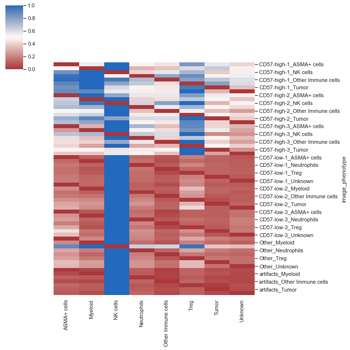
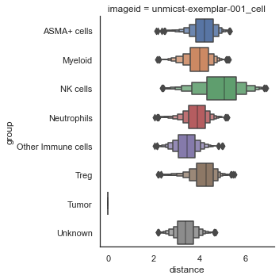
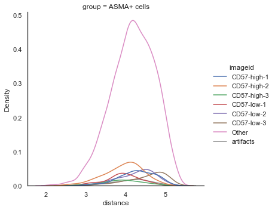
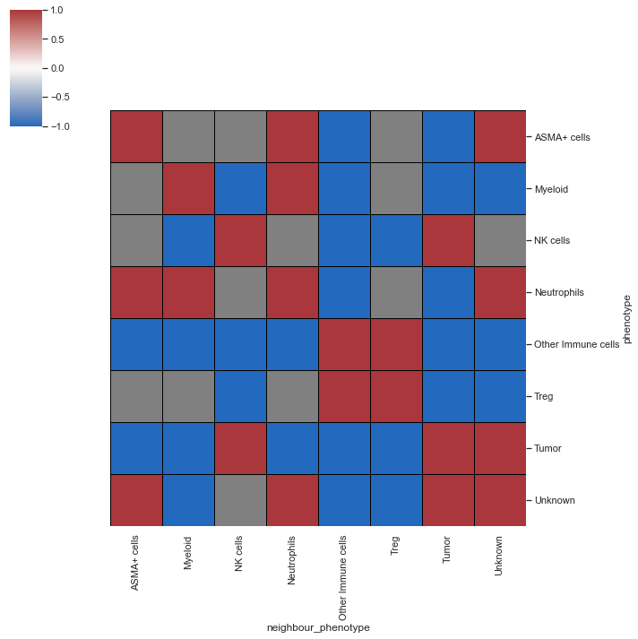
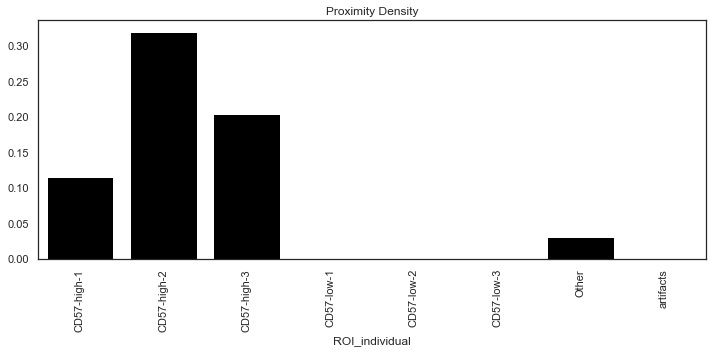
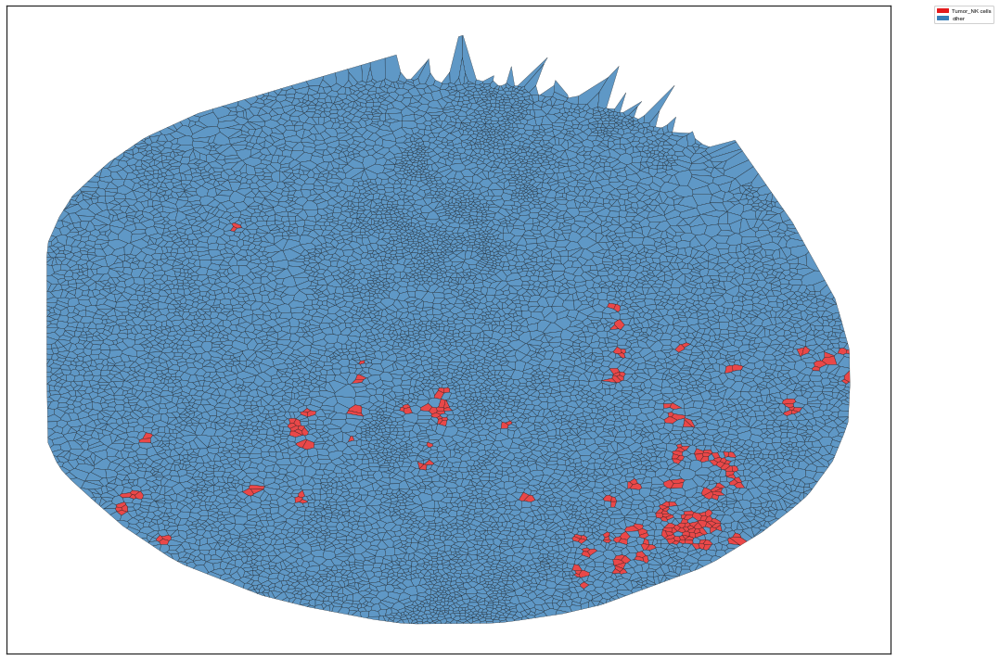

```python
"""
Created on Mon May 16 19:00:32 2022
@author: Ajit Johnson Nirmal
SCIMAP tutorial May 2022
"""
```


```python
# load packages
import scimap as sm
import scanpy as sc
import pandas as pd
import anndata as ad
```

## Tutorial material

You can download the material for this tutorial from the following [link:](https://www.dropbox.com/s/rra13zir52o9hio/getting_started%20and%20phenotyping.zip?dl=0)  
The jupyter notebook is available [here:](https://github.com/ajitjohnson/scimap_tutorials/tree/main/may_2022_tutorial)

## Tutorial video


```python
from IPython.display import HTML
HTML('<iframe width="450" height="250" src="https://www.youtube.com/embed/knh5elRksUk" frameborder="0" allow="accelerometer; autoplay; encrypted-media; gyroscope; picture-in-picture" allowfullscreen></iframe>')
```


<iframe width="450" height="250" src="https://www.youtube.com/embed/knh5elRksUk" frameborder="0" allow="accelerometer; autoplay; encrypted-media; gyroscope; picture-in-picture" allowfullscreen></iframe>


```python
common_path = "/Users/aj/Dropbox (Partners HealthCare)/conferences/scimap_tutorial/may_2022_tutorial/"
#common_path = "C:/Users/ajn16/Dropbox (Partners HealthCare)/conferences/scimap_tutorial/may_2022_tutorial/"
```


```python
# load data
#adata = sm.pp.mcmicro_to_scimap (image_path= str(common_path) + 'exemplar_001/quantification/unmicst-exemplar-001_cell.csv')
#manual_gate = pd.read_csv(str(common_path) + 'manual_gates.csv')
#adata = sm.pp.rescale (adata, gate=manual_gate)
#phenotype = pd.read_csv(str(common_path) + 'phenotype_workflow.csv')
#adata = sm.tl.phenotype_cells (adata, phenotype=phenotype, label="phenotype") 
# add user defined ROI's before proceeding
```


```python
# load saved anndata object
adata = ad.read(str(common_path) + 'may2022_tutorial.h5ad')
```


```python

```

### Calculate distances between cell types

`sm.tl.spatial_distance`: The function allows users to calculate the average shortest between phenotypes or clusters of interest (3D data supported).


```python
adata = sm.tl.spatial_distance (adata, 
                               x_coordinate='X_centroid', y_coordinate='Y_centroid', 
                               z_coordinate=None, 
                               phenotype='phenotype', 
                               subset=None, 
                               imageid='imageid', 
                               label='spatial_distance')
```

    Processing Image: unmicst-exemplar-001_cell


```python
adata.uns['spatial_distance']
```


<div>
<style scoped>
    .dataframe tbody tr th:only-of-type {
        vertical-align: middle;
    }

    .dataframe tbody tr th {
        vertical-align: top;
    }

    .dataframe thead th {
        text-align: right;
    }
</style>
<table border="1" class="dataframe">
  <thead>
    <tr style="text-align: right;">
      <th></th>
      <th>Other Immune cells</th>
      <th>Unknown</th>
      <th>Myeloid</th>
      <th>Tumor</th>
      <th>ASMA+ cells</th>
      <th>Neutrophils</th>
      <th>Treg</th>
      <th>NK cells</th>
    </tr>
  </thead>
  <tbody>
    <tr>
      <th>unmicst-exemplar-001_cell_1</th>
      <td>0.000000</td>
      <td>508.809972</td>
      <td>561.874000</td>
      <td>547.544519</td>
      <td>506.115689</td>
      <td>581.323686</td>
      <td>570.267087</td>
      <td>1248.001853</td>
    </tr>
    <tr>
      <th>unmicst-exemplar-001_cell_2</th>
      <td>0.000000</td>
      <td>25.516388</td>
      <td>63.601485</td>
      <td>67.024246</td>
      <td>27.928445</td>
      <td>157.289841</td>
      <td>100.258654</td>
      <td>816.837582</td>
    </tr>
    <tr>
      <th>unmicst-exemplar-001_cell_3</th>
      <td>0.000000</td>
      <td>15.315383</td>
      <td>59.503385</td>
      <td>56.590105</td>
      <td>34.479892</td>
      <td>147.005355</td>
      <td>96.374952</td>
      <td>817.307871</td>
    </tr>
    <tr>
      <th>unmicst-exemplar-001_cell_4</th>
      <td>0.000000</td>
      <td>28.482334</td>
      <td>13.752853</td>
      <td>51.500837</td>
      <td>46.148651</td>
      <td>111.763900</td>
      <td>143.243322</td>
      <td>746.050742</td>
    </tr>
    <tr>
      <th>unmicst-exemplar-001_cell_5</th>
      <td>26.357699</td>
      <td>0.000000</td>
      <td>45.589024</td>
      <td>30.234937</td>
      <td>58.354288</td>
      <td>120.715789</td>
      <td>96.739267</td>
      <td>824.241184</td>
    </tr>
    <tr>
      <th>...</th>
      <td>...</td>
      <td>...</td>
      <td>...</td>
      <td>...</td>
      <td>...</td>
      <td>...</td>
      <td>...</td>
      <td>...</td>
    </tr>
    <tr>
      <th>unmicst-exemplar-001_cell_11166</th>
      <td>0.000000</td>
      <td>106.320078</td>
      <td>70.605640</td>
      <td>96.293073</td>
      <td>50.637223</td>
      <td>91.990689</td>
      <td>43.229554</td>
      <td>410.740868</td>
    </tr>
    <tr>
      <th>unmicst-exemplar-001_cell_11167</th>
      <td>0.000000</td>
      <td>31.114913</td>
      <td>72.531210</td>
      <td>118.065360</td>
      <td>54.921505</td>
      <td>136.323479</td>
      <td>30.072174</td>
      <td>399.697389</td>
    </tr>
    <tr>
      <th>unmicst-exemplar-001_cell_11168</th>
      <td>0.000000</td>
      <td>50.369768</td>
      <td>70.748013</td>
      <td>126.968337</td>
      <td>36.065610</td>
      <td>123.048957</td>
      <td>40.094561</td>
      <td>409.435592</td>
    </tr>
    <tr>
      <th>unmicst-exemplar-001_cell_11169</th>
      <td>0.000000</td>
      <td>103.275795</td>
      <td>64.057762</td>
      <td>91.786425</td>
      <td>64.741519</td>
      <td>93.600860</td>
      <td>35.697321</td>
      <td>397.194037</td>
    </tr>
    <tr>
      <th>unmicst-exemplar-001_cell_11170</th>
      <td>10.165511</td>
      <td>0.000000</td>
      <td>88.288672</td>
      <td>113.521913</td>
      <td>86.006117</td>
      <td>150.562555</td>
      <td>23.735243</td>
      <td>389.273701</td>
    </tr>
  </tbody>
</table>
<p>11170 rows × 8 columns</p>
</div>


```python
# summary heatmap
import matplotlib.pyplot as plt
plt.rcParams['figure.figsize'] = [3, 1]
sm.pl.spatial_distance (adata)
```


    

    


```python
# Heatmap without summarizing the individual images
sm.pl.spatial_distance (adata, heatmap_summarize=False)
```


    

    


```python
sm.pl.spatial_distance (adata, heatmap_summarize=False, imageid='ROI_individual')
```


    

    


```python
# Numeric plot of shortest distance of phenotypes 
# from tumor cells
sm.pl.spatial_distance (adata, method='numeric',distance_from='Tumor')
```


    

    


```python
sm.pl.spatial_distance (adata, method='numeric',distance_from='Tumor', log=True)
```


    

    


```python
# plot for each ROI seperately
sm.pl.spatial_distance (adata, method='numeric',distance_from='Tumor', imageid='ROI')
```


    

    


```python
sm.pl.spatial_distance (adata, method='numeric',distance_from='Tumor', imageid='ROI', log=True)
```


    

    


```python
# Distribution plot of shortest distance of phenotypes from Tumor cells
sm.pl.spatial_distance (adata, method='distribution',distance_from='Tumor',distance_to = 'ASMA+ cells',
    imageid='ROI_individual', log=True)
```


    

    


```python

```

### Spatial co-occurance analysis

`sm.tl.spatial_interaction`: The function allows users to computes how likely celltypes are found next to each another compared to random background (3D data supported).


```python
# Using the radius method to identify local neighbours compute P-values
adata = sm.tl.spatial_interaction (adata, 
                                  method='radius', 
                                  radius=30, 
                                  label='spatial_interaction_radius')
```

    Processing Image: ['unmicst-exemplar-001_cell']
    Categories (1, object): ['unmicst-exemplar-001_cell']
    Identifying neighbours within 30 pixels of every cell
    Mapping phenotype to neighbors
    Performing 1000 permutations
    Consolidating the permutation results


```python
# Using the KNN method to identify local neighbours 
adata = sm.tl.spatial_interaction(adata, 
                                  method='knn', 
                                  knn=10, 
                                  label='spatial_interaction_knn')
```

    Processing Image: ['unmicst-exemplar-001_cell']
    Categories (1, object): ['unmicst-exemplar-001_cell']
    Identifying the 10 nearest neighbours for every cell
    Mapping phenotype to neighbors
    Performing 1000 permutations
    Consolidating the permutation results


```python
# view results
# spatial_interaction heatmap for a single image
sm.pl.spatial_interaction(adata, 
                          summarize_plot=True, 
                          binary_view=True,
                          spatial_interaction='spatial_interaction_radius',
                          row_cluster=False, linewidths=0.75, linecolor='black')

```


    

    


```python
# spatial_interaction heatmap for a single image
sm.pl.spatial_interaction(adata, 
                          summarize_plot=True, 
                          binary_view=True,
                          spatial_interaction='spatial_interaction_knn',
                          row_cluster=False, linewidths=0.75, linecolor='black')
```


    

    


```python
# Pass the ROI's as different images
adata = sm.tl.spatial_interaction(adata, 
                                  method='radius', 
                                  imageid = 'ROI_individual',
                                  radius=30, 
                                  label='spatial_interaction_radius_roi')
```

    Processing Image: ['Other']
    Categories (1, object): ['Other']
    Identifying neighbours within 30 pixels of every cell
    Mapping phenotype to neighbors
    Performing 1000 permutations
    Consolidating the permutation results
    Processing Image: ['artifacts']
    Categories (1, object): ['artifacts']
    Identifying neighbours within 30 pixels of every cell
    Mapping phenotype to neighbors
    Performing 1000 permutations
    Consolidating the permutation results
    Processing Image: ['CD57-low-1']
    Categories (1, object): ['CD57-low-1']
    Identifying neighbours within 30 pixels of every cell
    Mapping phenotype to neighbors
    Performing 1000 permutations
    Consolidating the permutation results
    Processing Image: ['CD57-low-3']
    Categories (1, object): ['CD57-low-3']
    Identifying neighbours within 30 pixels of every cell
    Mapping phenotype to neighbors
    Performing 1000 permutations
    Consolidating the permutation results
    Processing Image: ['CD57-low-2']
    Categories (1, object): ['CD57-low-2']
    Identifying neighbours within 30 pixels of every cell
    Mapping phenotype to neighbors
    Performing 1000 permutations
    Consolidating the permutation results
    Processing Image: ['CD57-high-3']
    Categories (1, object): ['CD57-high-3']
    Identifying neighbours within 30 pixels of every cell
    Mapping phenotype to neighbors
    Performing 1000 permutations
    Consolidating the permutation results
    Processing Image: ['CD57-high-1']
    Categories (1, object): ['CD57-high-1']
    Identifying neighbours within 30 pixels of every cell
    Mapping phenotype to neighbors
    Performing 1000 permutations
    Consolidating the permutation results
    Processing Image: ['CD57-high-2']
    Categories (1, object): ['CD57-high-2']
    Identifying neighbours within 30 pixels of every cell
    Mapping phenotype to neighbors
    Performing 1000 permutations
    Consolidating the permutation results


```python
# spatial_interaction heatmap
sm.pl.spatial_interaction(adata, 
                          summarize_plot=True, 
                          spatial_interaction='spatial_interaction_radius_roi',
                          row_cluster=True, linewidths=0.75, linecolor='black')
```


    

    


```python
# spatial_interaction heatmap
sm.pl.spatial_interaction(adata, 
                          summarize_plot=False, 
                          spatial_interaction='spatial_interaction_radius_roi',
                          yticklabels=True,
                          row_cluster=True, linewidths=0.75, linecolor='black')
```


    

    


```python

```

### Quantifying the proximity score

`sm.tl.spatial_pscore`: A scoring system to evaluate user defined proximity between cell types.  

The function generates two scores and saved at adata.uns:  
- Proximity Density: Total number of interactions identified divided by the total number of cells of the cell-types that were used for interaction analysis.  
- Proximity Volume: Total number of interactions identified divided by the total number of all cells in the data.
The interaction sites are also recorded and saved in adata.obs


```python
# Calculate the score for proximity between `Tumor CD30+` cells and `M2 Macrophages`
adata =  sm.tl.spatial_pscore (adata,proximity= ['Tumor', 'NK cells'],
                               score_by = 'ROI_individual',
                               phenotype='phenotype',
                               method='radius',
                               radius=20,
                               subset=None, 
                               label='spatial_pscore')
```

    Identifying neighbours within 20 pixels of every cell
    Finding neighbourhoods with Tumor
    Finding neighbourhoods with NK cells
    Please check:
    adata.obs['spatial_pscore'] &
    adata.uns['spatial_pscore'] for results


```python
# Plot only `Proximity Volume` scores
plt.figure(figsize=(10, 5))
sm.pl.spatial_pscore (adata, color='Black', plot_score='Proximity Volume')
```

    /opt/anaconda3/envs/scimap/lib/python3.9/site-packages/seaborn/_decorators.py:36: FutureWarning:
    
    Pass the following variables as keyword args: x, y. From version 0.12, the only valid positional argument will be `data`, and passing other arguments without an explicit keyword will result in an error or misinterpretation.
    


    

    


```python
# Plot only `Proximity Density` scores
plt.figure(figsize=(10, 5))
sm.pl.spatial_pscore (adata, color='Black', plot_score='Proximity Density')
```

    /opt/anaconda3/envs/scimap/lib/python3.9/site-packages/seaborn/_decorators.py:36: FutureWarning:
    
    Pass the following variables as keyword args: x, y. From version 0.12, the only valid positional argument will be `data`, and passing other arguments without an explicit keyword will result in an error or misinterpretation.
    


    

    


```python
# voronoi plot
plt.rcParams['figure.figsize'] = [15, 10]
sm.pl.voronoi(adata, color_by='spatial_pscore', 
                 voronoi_edge_color = 'black',
                 voronoi_line_width = 0.3, 
                 voronoi_alpha = 0.8, 
                 size_max=5000,
                 overlay_points=None, 
                 plot_legend=True, 
                 legend_size=6)
```


    

    


```python
# save adata
adata.write(str(common_path) + 'may2022_tutorial.h5ad')
```

    /opt/anaconda3/envs/scimap/lib/python3.9/site-packages/anndata/_core/anndata.py:1228: FutureWarning:
    
    The `inplace` parameter in pandas.Categorical.reorder_categories is deprecated and will be removed in a future version. Reordering categories will always return a new Categorical object.
    
    ... storing 'spatial_pscore' as categorical


This concludes this tutorial
