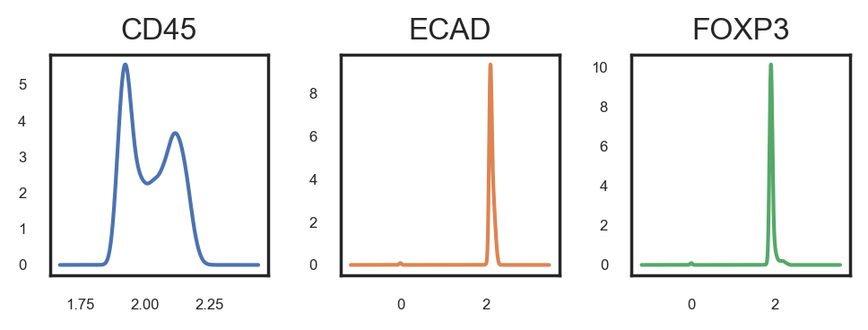
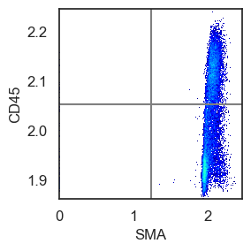
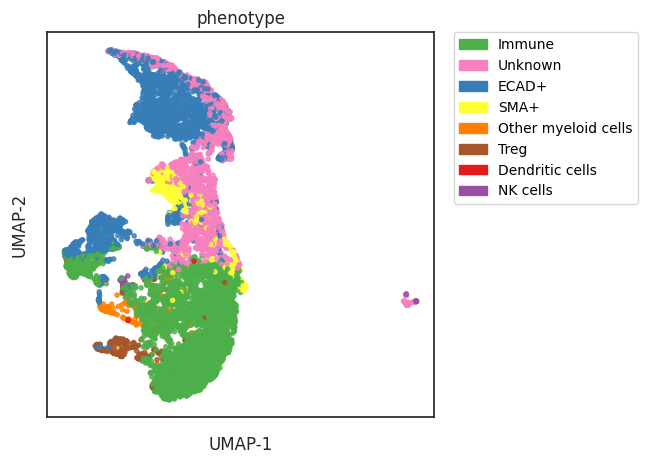

# 👽 Cell phenotyping using a Hierarchical Prior Knowledge Table


```python
# import packages
import scimap as sm
import anndata as ad
import pandas as pd
```

    Running SCIMAP  1.3.14


```python
# Load the data that we saved in the last tutorial - (Prepare data for SCIMAP)
adata = ad.read_h5ad('/Users/aj/Dropbox (Partners HealthCare)/nirmal lab/resources/exemplarData/scimapExampleData/scimapExampleData.h5ad')
```

This method requires more work but is significantly more sensitive and scalable compared to clustering-based approaches.

### To run the method, you'll need two main components:

To successfully execute the method, you will need:

1. A `.csv` file containing manual gates. Should manual gates be absent, the algorithm will attempt to adjust the data by fitting two Gaussian distributions. Nonetheless, employing manual gating is recommended due to its heightened sensitivity.
2. A `.csv` file outlining a gating workflow strategy.

The execution of the algorithm is structured into three primary steps:

1. **Gate Identification**: Utilize `sm.pl.gate_finder` to identify the gates.
2. **Data Rescaling**: Apply `sm.pp.rescale` to adjust the data based on the identified gates.
3. **Phenotyping**: Process the rescaled data using `sm.tl.phenotype` to run the phenotyping algorithm.

### Step 1: Define manual gates


```python
%gui qt
```

This method will launch a napari window displaying several layers, each representing a different gate. You can toggle these layers on and off with the goal of identifying the gate that most accurately captures the positive cells. It's crucial to zoom and pan through the image to ensure the selected gate encompasses all positive cells throughout the image. Bear in mind that achieving 100% accuracy might not be feasible, so a certain margin of error may need to be accepted. This process is iterative, meaning adjustments may be necessary even after initial phenotyping and analysis. Manual gating must be conducted independently for each marker and each image.


```python
image_path = '/Users/aj/Dropbox (Partners HealthCare)/nirmal lab/resources/exemplarData/scimapExampleData/registration/exemplar-001.ome.tif'
marker_of_interest = 'CD45'
```


```python
sm.pl.gate_finder (image_path, adata, marker_of_interest, from_gate = 5, to_gate = 9, increment = 0.1, point_size=6)
```


```python
# Do the above step for each marker and then create a `.csv` file like below:
pd.read_csv('/Users/aj/Dropbox (Partners HealthCare)/nirmal lab/resources/exemplarData/scimapExampleData/manual_gates.csv')
```


<div>
<style scoped>
    .dataframe tbody tr th:only-of-type {
        vertical-align: middle;
    }

    .dataframe tbody tr th {
        vertical-align: top;
    }

    .dataframe thead th {
        text-align: right;
    }
</style>
<table border="1" class="dataframe">
  <thead>
    <tr style="text-align: right;">
      <th></th>
      <th>marker</th>
      <th>exemplar-001--unmicst_cell</th>
    </tr>
  </thead>
  <tbody>
    <tr>
      <th>0</th>
      <td>ELANE</td>
      <td>7.80</td>
    </tr>
    <tr>
      <th>1</th>
      <td>CD57</td>
      <td>8.90</td>
    </tr>
    <tr>
      <th>2</th>
      <td>CD45</td>
      <td>6.40</td>
    </tr>
    <tr>
      <th>3</th>
      <td>CD11B</td>
      <td>7.60</td>
    </tr>
    <tr>
      <th>4</th>
      <td>SMA</td>
      <td>7.50</td>
    </tr>
    <tr>
      <th>5</th>
      <td>CD16</td>
      <td>6.50</td>
    </tr>
    <tr>
      <th>6</th>
      <td>ECAD</td>
      <td>7.35</td>
    </tr>
    <tr>
      <th>7</th>
      <td>FOXP3</td>
      <td>7.40</td>
    </tr>
    <tr>
      <th>8</th>
      <td>NCAM</td>
      <td>7.00</td>
    </tr>
  </tbody>
</table>
</div>


You'll observe that the first column lists the markers present in the dataset, while the second column specifies the gate, named after the specific image's ID found in `adata.obs['imageid']`. This  is especially useful when dealing with datasets containing multiple images, as it allows for a distinct column for each image.

Although visual gating has proven to be the most sensitive method for us, you can also apply single and bi-marker gating approaches, similar to FACS, to assist in determining a threshold.


```python
# single 
sm.pl.distPlot(adata, layer='log', markers=['CD45','ECAD','FOXP3'], ncols=3, fontsize=6, figsize=(5,2))
```


    

    


We also use bimarker gating to identify a gate


```python
sm.pl.densityPlot2D(adata, markerA='SMA', markerB='CD45', layer='log')

```

    /Users/aj/miniconda3/envs/scimap/lib/python3.10/site-packages/mpl_scatter_density/generic_density_artist.py:77: RuntimeWarning:
    
    All-NaN slice encountered
    
    /Users/aj/miniconda3/envs/scimap/lib/python3.10/site-packages/mpl_scatter_density/generic_density_artist.py:82: RuntimeWarning:
    
    All-NaN slice encountered
    


    

    


### Step 2: Rescale the data

Here, we input a `manual_gates.csv` file into the gate parameter. This file contains gates determined visually with the help of the `sm.pl.gate_finder` function. For the markers specified in the `manual_gates.csv` file, the function will adjust the data so that cells exhibiting expression levels above the gate threshold are classified as positive for that marker, while those with expression levels below the threshold are deemed negative.

For markers not listed in the `manual_gates.csv` file, the function will employ an automatic approach to identify suitable gates by applying a Gaussian mixture model algorithm to the data.


```python
# Load the manual gates and rescale the data based on the gates
manual_gate = pd.read_csv('/Users/aj/Dropbox (Partners HealthCare)/nirmal lab/resources/exemplarData/scimapExampleData/manual_gates.csv')
adata = sm.pp.rescale (adata, gate=manual_gate)
```

    Scaling Image exemplar-001--unmicst_cell
    Scaling ELANE
    Scaling CD57
    Scaling CD45
    Scaling CD11B
    Scaling SMA
    Scaling CD16
    Scaling ECAD
    Scaling FOXP3
    Scaling NCAM


    /Users/aj/miniconda3/envs/scimap/lib/python3.10/site-packages/scimap/preprocessing/rescale.py:105: FutureWarning:
    
    Downcasting object dtype arrays on .fillna, .ffill, .bfill is deprecated and will change in a future version. Call result.infer_objects(copy=False) instead. To opt-in to the future behavior, set `pd.set_option('future.no_silent_downcasting', True)`
    


### Step 3: Run the phenotyping algorithm


```python
# load the phenotyping workflow
phenotype = pd.read_csv('/Users/aj/Dropbox (Partners HealthCare)/nirmal lab/resources/exemplarData/scimapExampleData/phenotype_workflow.csv')
# view the table:
phenotype.style.format(na_rep='')
```


<style type="text/css">
</style>
<table id="T_eb6ba">
  <thead>
    <tr>
      <th class="blank level0" >&nbsp;</th>
      <th id="T_eb6ba_level0_col0" class="col_heading level0 col0" >Unnamed: 0</th>
      <th id="T_eb6ba_level0_col1" class="col_heading level0 col1" >Unnamed: 1</th>
      <th id="T_eb6ba_level0_col2" class="col_heading level0 col2" >ELANE</th>
      <th id="T_eb6ba_level0_col3" class="col_heading level0 col3" >CD57</th>
      <th id="T_eb6ba_level0_col4" class="col_heading level0 col4" >CD45</th>
      <th id="T_eb6ba_level0_col5" class="col_heading level0 col5" >CD11B</th>
      <th id="T_eb6ba_level0_col6" class="col_heading level0 col6" >SMA</th>
      <th id="T_eb6ba_level0_col7" class="col_heading level0 col7" >CD16</th>
      <th id="T_eb6ba_level0_col8" class="col_heading level0 col8" >ECAD</th>
      <th id="T_eb6ba_level0_col9" class="col_heading level0 col9" >FOXP3</th>
      <th id="T_eb6ba_level0_col10" class="col_heading level0 col10" >NCAM</th>
    </tr>
  </thead>
  <tbody>
    <tr>
      <th id="T_eb6ba_level0_row0" class="row_heading level0 row0" >0</th>
      <td id="T_eb6ba_row0_col0" class="data row0 col0" >all</td>
      <td id="T_eb6ba_row0_col1" class="data row0 col1" >ECAD+</td>
      <td id="T_eb6ba_row0_col2" class="data row0 col2" ></td>
      <td id="T_eb6ba_row0_col3" class="data row0 col3" ></td>
      <td id="T_eb6ba_row0_col4" class="data row0 col4" ></td>
      <td id="T_eb6ba_row0_col5" class="data row0 col5" ></td>
      <td id="T_eb6ba_row0_col6" class="data row0 col6" ></td>
      <td id="T_eb6ba_row0_col7" class="data row0 col7" ></td>
      <td id="T_eb6ba_row0_col8" class="data row0 col8" >pos</td>
      <td id="T_eb6ba_row0_col9" class="data row0 col9" ></td>
      <td id="T_eb6ba_row0_col10" class="data row0 col10" ></td>
    </tr>
    <tr>
      <th id="T_eb6ba_level0_row1" class="row_heading level0 row1" >1</th>
      <td id="T_eb6ba_row1_col0" class="data row1 col0" >all</td>
      <td id="T_eb6ba_row1_col1" class="data row1 col1" >Immune</td>
      <td id="T_eb6ba_row1_col2" class="data row1 col2" ></td>
      <td id="T_eb6ba_row1_col3" class="data row1 col3" ></td>
      <td id="T_eb6ba_row1_col4" class="data row1 col4" >pos</td>
      <td id="T_eb6ba_row1_col5" class="data row1 col5" ></td>
      <td id="T_eb6ba_row1_col6" class="data row1 col6" ></td>
      <td id="T_eb6ba_row1_col7" class="data row1 col7" ></td>
      <td id="T_eb6ba_row1_col8" class="data row1 col8" ></td>
      <td id="T_eb6ba_row1_col9" class="data row1 col9" ></td>
      <td id="T_eb6ba_row1_col10" class="data row1 col10" ></td>
    </tr>
    <tr>
      <th id="T_eb6ba_level0_row2" class="row_heading level0 row2" >2</th>
      <td id="T_eb6ba_row2_col0" class="data row2 col0" >all</td>
      <td id="T_eb6ba_row2_col1" class="data row2 col1" >SMA+</td>
      <td id="T_eb6ba_row2_col2" class="data row2 col2" ></td>
      <td id="T_eb6ba_row2_col3" class="data row2 col3" ></td>
      <td id="T_eb6ba_row2_col4" class="data row2 col4" ></td>
      <td id="T_eb6ba_row2_col5" class="data row2 col5" ></td>
      <td id="T_eb6ba_row2_col6" class="data row2 col6" >pos</td>
      <td id="T_eb6ba_row2_col7" class="data row2 col7" ></td>
      <td id="T_eb6ba_row2_col8" class="data row2 col8" ></td>
      <td id="T_eb6ba_row2_col9" class="data row2 col9" ></td>
      <td id="T_eb6ba_row2_col10" class="data row2 col10" ></td>
    </tr>
    <tr>
      <th id="T_eb6ba_level0_row3" class="row_heading level0 row3" >3</th>
      <td id="T_eb6ba_row3_col0" class="data row3 col0" >Immune</td>
      <td id="T_eb6ba_row3_col1" class="data row3 col1" >NK cells</td>
      <td id="T_eb6ba_row3_col2" class="data row3 col2" ></td>
      <td id="T_eb6ba_row3_col3" class="data row3 col3" >allpos</td>
      <td id="T_eb6ba_row3_col4" class="data row3 col4" ></td>
      <td id="T_eb6ba_row3_col5" class="data row3 col5" >neg</td>
      <td id="T_eb6ba_row3_col6" class="data row3 col6" ></td>
      <td id="T_eb6ba_row3_col7" class="data row3 col7" >allpos</td>
      <td id="T_eb6ba_row3_col8" class="data row3 col8" ></td>
      <td id="T_eb6ba_row3_col9" class="data row3 col9" ></td>
      <td id="T_eb6ba_row3_col10" class="data row3 col10" ></td>
    </tr>
    <tr>
      <th id="T_eb6ba_level0_row4" class="row_heading level0 row4" >4</th>
      <td id="T_eb6ba_row4_col0" class="data row4 col0" >Immune</td>
      <td id="T_eb6ba_row4_col1" class="data row4 col1" >Other myeloid cells</td>
      <td id="T_eb6ba_row4_col2" class="data row4 col2" ></td>
      <td id="T_eb6ba_row4_col3" class="data row4 col3" ></td>
      <td id="T_eb6ba_row4_col4" class="data row4 col4" ></td>
      <td id="T_eb6ba_row4_col5" class="data row4 col5" >pos</td>
      <td id="T_eb6ba_row4_col6" class="data row4 col6" ></td>
      <td id="T_eb6ba_row4_col7" class="data row4 col7" ></td>
      <td id="T_eb6ba_row4_col8" class="data row4 col8" ></td>
      <td id="T_eb6ba_row4_col9" class="data row4 col9" ></td>
      <td id="T_eb6ba_row4_col10" class="data row4 col10" ></td>
    </tr>
    <tr>
      <th id="T_eb6ba_level0_row5" class="row_heading level0 row5" >5</th>
      <td id="T_eb6ba_row5_col0" class="data row5 col0" >Immune</td>
      <td id="T_eb6ba_row5_col1" class="data row5 col1" >Treg</td>
      <td id="T_eb6ba_row5_col2" class="data row5 col2" ></td>
      <td id="T_eb6ba_row5_col3" class="data row5 col3" ></td>
      <td id="T_eb6ba_row5_col4" class="data row5 col4" ></td>
      <td id="T_eb6ba_row5_col5" class="data row5 col5" ></td>
      <td id="T_eb6ba_row5_col6" class="data row5 col6" ></td>
      <td id="T_eb6ba_row5_col7" class="data row5 col7" ></td>
      <td id="T_eb6ba_row5_col8" class="data row5 col8" ></td>
      <td id="T_eb6ba_row5_col9" class="data row5 col9" >pos</td>
      <td id="T_eb6ba_row5_col10" class="data row5 col10" ></td>
    </tr>
    <tr>
      <th id="T_eb6ba_level0_row6" class="row_heading level0 row6" >6</th>
      <td id="T_eb6ba_row6_col0" class="data row6 col0" >Other myeloid cells</td>
      <td id="T_eb6ba_row6_col1" class="data row6 col1" >Dendritic cells</td>
      <td id="T_eb6ba_row6_col2" class="data row6 col2" ></td>
      <td id="T_eb6ba_row6_col3" class="data row6 col3" >allneg</td>
      <td id="T_eb6ba_row6_col4" class="data row6 col4" ></td>
      <td id="T_eb6ba_row6_col5" class="data row6 col5" ></td>
      <td id="T_eb6ba_row6_col6" class="data row6 col6" ></td>
      <td id="T_eb6ba_row6_col7" class="data row6 col7" >allneg</td>
      <td id="T_eb6ba_row6_col8" class="data row6 col8" ></td>
      <td id="T_eb6ba_row6_col9" class="data row6 col9" ></td>
      <td id="T_eb6ba_row6_col10" class="data row6 col10" ></td>
    </tr>
  </tbody>
</table>


As it can be seen from the table above,  

1. The `first column` has to contain the cell that are to be classified.  
2. The `second column` indicates the phenotype a particular cell will be assigned if it satifies the conditions in the row.  
3. `Column three` and onward represent protein markers. If the protein marker is known to be expressed for that cell type, then it is denoted by either `pos`, `allpos`. If the protein marker is known to not express for a cell type it can be denoted by `neg`, `allneg`. If the protein marker is irrelevant or uncertain to express for a cell type, then it is left empty. `anypos` and `anyneg` are options for using a set of markers and if any of the marker is positive or negative, the cell type is denoted accordingly.

**To give users maximum flexibility in identifying desired cell types, we have implemented various classification arguments as described above for strategical classification. They include**

- allpos
- allneg
- anypos
- anyneg
- pos
- neg
  
`pos` : "Pos" looks for cells positive for a given marker. If multiple markers are annotated as `pos`, all must be positive to denote the cell type. For example, a Regulatory T cell can be defined as `CD3+CD4+FOXP3+` by passing `pos` to each marker. If one or more markers don't meet the criteria (e.g. CD4-), the program will classify it as `Likely-Regulatory-T cell`, pending user confirmation. This is useful in cases of technical artifacts or when cell types (such as cancer cells) are defined by marker loss (e.g. T-cell Lymphomas).
  
`neg` : Same as `pos` but looks for negativity of the defined markers. 
  
`allpos` : "Allpos" requires all defined markers to be positive. Unlike `pos`, it doesn't classify cells as `Likely-cellType`, but strictly annotates cells positive for all defined markers.
  
`allneg` : Same as `allpos` but looks for negativity of the defined markers. 
  
`anypos` : "Anypos" requires only one of the defined markers to be positive. For example, to define macrophages, a cell could be designated as such if any of `CD68`, `CD163`, or `CD206` is positive.
  
`anyneg` : Same as `anyneg` but looks for negativity of the defined markers. 


```python
adata = sm.tl.phenotype_cells (adata, phenotype=phenotype, label="phenotype") 
```

    Phenotyping ECAD+
    Phenotyping Immune
    Phenotyping SMA+
    -- Subsetting Immune
    Phenotyping NK cells
    Phenotyping Other myeloid cells
    Phenotyping Treg
    -- Subsetting Other myeloid cells
    Phenotyping Dendritic cells
    Consolidating the phenotypes across all groups


    /Users/aj/miniconda3/envs/scimap/lib/python3.10/site-packages/scimap/tools/phenotype_cells.py:174: SettingWithCopyWarning:
    
    
    A value is trying to be set on a copy of a slice from a DataFrame.
    Try using .loc[row_indexer,col_indexer] = value instead
    
    See the caveats in the documentation: https://pandas.pydata.org/pandas-docs/stable/user_guide/indexing.html#returning-a-view-versus-a-copy
    
    /Users/aj/miniconda3/envs/scimap/lib/python3.10/site-packages/scimap/tools/phenotype_cells.py:290: FutureWarning:
    
    DataFrame.fillna with 'method' is deprecated and will raise in a future version. Use obj.ffill() or obj.bfill() instead.
    
    /Users/aj/miniconda3/envs/scimap/lib/python3.10/site-packages/scimap/tools/phenotype_cells.py:290: FutureWarning:
    
    Downcasting object dtype arrays on .fillna, .ffill, .bfill is deprecated and will change in a future version. Call result.infer_objects(copy=False) instead. To opt-in to the future behavior, set `pd.set_option('future.no_silent_downcasting', True)`
    


```python
# Summary of the phenotyping
adata.obs['phenotype'].value_counts()
```


    phenotype
    Immune                 4746
    ECAD+                  3015
    Unknown                2278
    SMA+                    602
    Treg                    282
    Other myeloid cells     193
    NK cells                 66
    Dendritic cells          19
    Name: count, dtype: int64


```python

```

## Visualisation of the Results


```python
# Heatmap (here values over 0.5 are considered positive as we have scaled the data)
sm.pl.heatmap(adata, groupBy='phenotype', standardScale=None, figsize=(5,3), showPrevalence=True, vmin=0, vmax=1)
```

    /Users/aj/miniconda3/envs/scimap/lib/python3.10/site-packages/scimap/plotting/heatmap.py:312: UserWarning:
    
    This figure includes Axes that are not compatible with tight_layout, so results might be incorrect.
    


    

    


```python
# view the phenotype on a UMAP
adata = sm.tl.umap(adata)

```

    /Users/aj/miniconda3/envs/scimap/lib/python3.10/site-packages/umap/umap_.py:1943: UserWarning:
    
    n_jobs value -1 overridden to 1 by setting random_state. Use no seed for parallelism.
    


```python
sm.pl.umap(adata, color=['phenotype'])
```

    /Users/aj/miniconda3/envs/scimap/lib/python3.10/site-packages/scimap/plotting/umap.py:267: UserWarning:
    
    No data for colormapping provided via 'c'. Parameters 'cmap' will be ignored
    


    

    


```python
# spatial scatter plot to look at the distribution of cells
sm.pl.spatial_scatterPlot (adata, colorBy = ['phenotype'],figsize=(2.75,2), s=0.3, fontsize=5, catCmap='Set1')
```


    

    


```python
# View the results by overlaying it on the raw image
image_path = '/Users/aj/Dropbox (Partners HealthCare)/nirmal lab/resources/exemplarData/scimapExampleData/registration/exemplar-001.ome.tif'

# view in napari
sm.pl.image_viewer(image_path=image_path, 
                   adata=adata, 
                   overlay='phenotype', 
                   point_size=10,
                   point_color='white')

# Note that if your AnnotatedData object (adata) includes multiple images, 
# you can use the `subset` parameter to specify the image name found in the `imageid` column, 
# enabling the loading of just that particular image.
```

### Save Results


```python
# Save the results
adata.write('/Users/aj/Dropbox (Partners HealthCare)/nirmal lab/resources/exemplarData/scimapExampleData/scimapExampleData.h5ad')
```


```python

```
